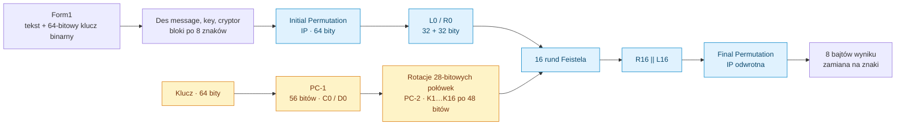
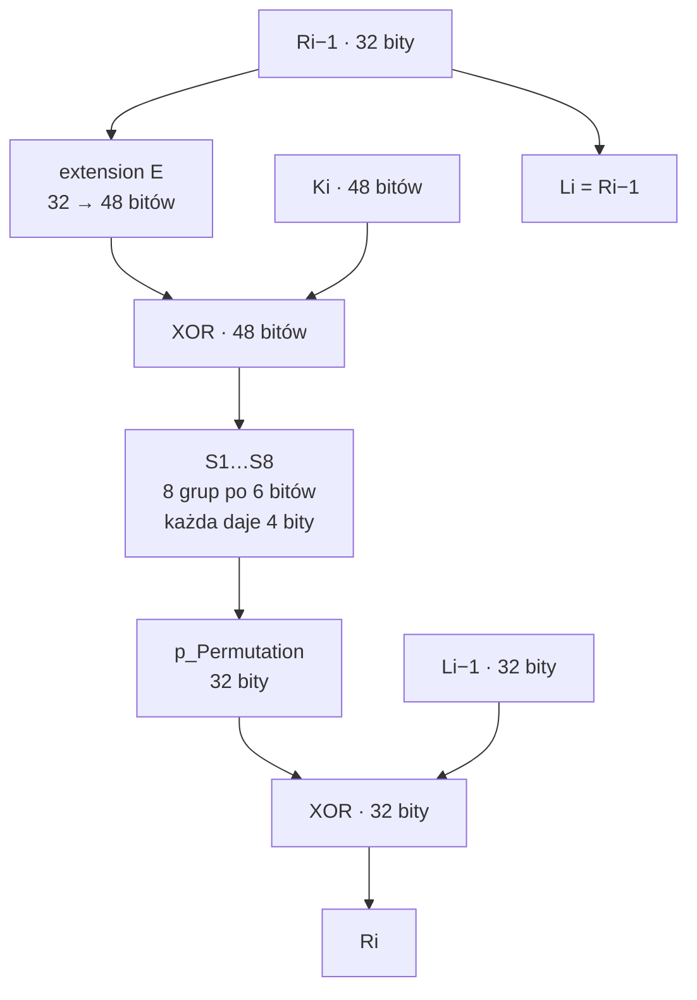

# Data Encryption Standard

Edukacyjna implementacja **DES w C#** z interfejsem Windows Forms. Rdzeń samodzielnie realizuje permutacje bitów, harmonogram podkluczy, osiem S-boxów i 16 rund sieci Feistela. Ten sam mechanizm służy do szyfrowania i deszyfrowania, z odwróconą kolejnością podkluczy.

Projekt pozwala prześledzić budowę historycznego szyfru blokowego. DES został wycofany przez NIST w 2005 roku z powodu niewystarczającego bezpieczeństwa; nie jest właściwym algorytmem do ochrony nowych danych. [Informacja NIST](https://www.nist.gov/news-events/news/2005/06/nist-withdraws-outdated-data-encryption-standard).

## Spis treści

- [Architektura i przepływ](#architektura-i-przepływ)
- [Blok danych i permutacje](#blok-danych-i-permutacje)
- [Harmonogram klucza](#harmonogram-klucza)
- [Runda Feistela i funkcja f](#runda-feistela-i-funkcja-f)
- [Dlaczego deszyfrowanie działa](#dlaczego-deszyfrowanie-działa)
- [Tekst i niezależne bloki](#tekst-i-niezależne-bloki)
- [Uruchomienie i sprawdzenie](#uruchomienie-i-sprawdzenie)
- [Ograniczenia](#ograniczenia)

## Architektura i przepływ



Opis funkcji i szerokości danych poniżej wynika z `Properties/Class1.cs`. Specyfikacja historyczna jest dostępna jako [FIPS 46-3](https://csrc.nist.gov/pubs/fips/46-3/final).

| Plik | Rola |
| --- | --- |
| `Properties/Class1.cs` | Klasa `DataEncryptionStandard` i cały rdzeń DES. |
| `Form1.cs` | Walidacja binarnego klucza i wywołania szyfrowania/deszyfrowania. |
| `Form1.Designer.cs`, `Form1.resx` | Kontrolki i zasoby interfejsu. |
| `Program.cs` | Punkt wejścia Windows Forms. |
| `WinFormsApp1.csproj` | Projekt WindowsDesktop, target `netcoreapp3.1`. |
| `WinFormsApp1.sln` | Rozwiązanie do otwarcia w Visual Studio. |

## Blok danych i permutacje

Rdzeń działa na słowach `UInt64`. `Des()` składa osiem wartości bajtowych w jeden blok, od najbardziej znaczącego bajtu. Przykładowo bajty `01 23 45 67 89 AB CD EF` dają `0x0123456789ABCDEF`.

`initialPermutation()` przestawia 64 bity według tablicy IP. Następnie `feistelNetwork()` dzieli wynik na lewą i prawą połowę po 32 bity. Po rundach skleja `R16 || L16`, a `finalPermutation()` wykonuje odwrotną permutację.

Permutacja nie zmienia wartości bitów, tylko ich pozycje. Nie wystarcza do ukrycia danych: jej tabela jest stała i publiczna. Właściwe mieszanie danych z kluczem zachodzi w rundach.

Tablice numerują bity od 1 po stronie najbardziej znaczącej. Dla pozycji `p` w 64-bitowym wejściu kod wybiera maskę `1UL << (64−p)`, a wynik buduje przez dopisanie bitu i przesunięcie. Analogiczny mechanizm obsługuje permutacje krótszych słów.

## Harmonogram klucza

Interfejs przyjmuje dokładnie **64 znaki `0`/`1`** i konwertuje je na `UInt64`. `permutedChoice()` (PC-1) wybiera 56 bitów, pomijając osiem bitów parzystości. Te 56 bitów dzielone jest na dwie połowy `C0` i `D0` po 28 bitów.

W każdej rundzie połowy są obracane cyklicznie w lewo. `rotate()` przenosi bit opuszczający najwyższą pozycję na najniższą, zamiast go odrzucać.

| Runda | 1 | 2 | 3 | 4 | 5 | 6 | 7 | 8 | 9 | 10 | 11 | 12 | 13 | 14 | 15 | 16 |
| --- | --- | --- | --- | --- | --- | --- | --- | --- | --- | --- | --- | --- | --- | --- | --- | --- |
| Rotacja | 1 | 1 | 2 | 2 | 2 | 2 | 2 | 2 | 1 | 2 | 2 | 2 | 2 | 2 | 2 | 1 |

Po każdej rotacji `permutedChoice2()` (PC-2) wybiera 48 bitów ze sklejenia `Ci || Di`, tworząc `Ki`.

```text
klucz 64-bitowy → PC-1 → C0, D0
Ci = ROTL28(Ci−1, przesunięcie_i)
Di = ROTL28(Di−1, przesunięcie_i)
Ki = PC-2(Ci || Di)
```

Klucz wejściowy ma 64 pozycje, ale tylko 56 wpływa na szyfrowanie. Interfejs sprawdza długość i znaki, lecz nie kontroluje parzystości ani kluczy słabych. Podklucze są generowane ponownie dla każdego bloku, mimo że klucz całej wiadomości pozostaje ten sam.

## Runda Feistela i funkcja f

Każda runda przekształca dwie połowy:

```text
Li = Ri−1
Ri = Li−1 XOR f(Ri−1, Ki)
```

Lewa połowa staje się starą prawą. Nowa prawa łączy starą lewą z wynikiem funkcji `f`. W kodzie odpowiadają temu `temp = left`, `left = right`, `right = temp ^ f`.



### Ekspansja E i XOR z podkluczem

`extension()` wybiera z 32-bitowej prawej połowy 48 pozycji; część bitów pojawia się dwukrotnie. Pozwala to utworzyć osiem grup po sześć bitów i wprowadza zależności między sąsiednimi grupami.

Wynik jest XOR-owany z 48-bitowym `Ki`. XOR daje 1, gdy bity są różne. Jest odwracalny: `a XOR k XOR k = a`.

### S-boxy: nieliniowa część rundy

Każda grupa sześciu bitów trafia do odpowiadającego jej S-boxa. Pierwszy i ostatni bit wyznaczają wiersz 0–3; środkowe cztery bity kolumnę 0–15. Wynik tablicy ma cztery bity.

Przykład dla wejścia S1 `011011`:

```text
wiersz = 01₂ = 1
kolumna = 1101₂ = 13
S1[1,13] = 5 = 0101₂
```

Osiem takich wyników daje 32-bitowe słowo. S-boxy wprowadzają nieliniowość; nie są prostą permutacją i nie mają jednoznacznej odwrotności dla każdego wejścia, ponieważ zmniejszają szerokość z 6 do 4 bitów.

### Permutacja P

`p_Permutation()` przestawia 32 bity po S-boxach. Rozprowadza ich wyniki do różnych pozycji następnej rundy. Wielokrotne ekspansje, podstawienia, XOR-y i zamiany połówek powodują, że wpływ pojedynczego bitu wejścia lub klucza rozchodzi się po bloku.

## Dlaczego deszyfrowanie działa

Funkcja `f` nie musi być odwracalna. Znając wynik rundy i podklucz, można odtworzyć poprzedni stan:

```text
Ri−1 = Li
Li−1 = Ri XOR f(Li, Ki)
```

Wystarczy ponownie obliczyć `f` i użyć samoodwracalności XOR. Sieć z zamianą połówek pozwala zastosować ten sam przebieg z odwróconą kolejnością kluczy.

W `feistelNetwork()`:

- szyfrowanie używa `keyBox[i−1]`, czyli `K1…K16`;
- deszyfrowanie używa `keyBox[16−i]`, czyli `K16…K1`.

`Des(..., cryptor=true)` i `Des(..., cryptor=false)` różnią się tym parametrem. Końcowa zamiana połówek i odwrotna IP pozostają częścią obu przebiegów.

## Tekst i niezależne bloki

`Des()` dzieli wiadomość po **osiem znaków**, konwertując każdy przez `Convert.ToByte(char)`. Obsługiwane są wartości znaków 0–255; to nie jest kodowanie UTF-8. Wiele polskich znaków przekracza ten zakres i może spowodować wyjątek.

Niepełny blok jest dopisywany spacjami do wielokrotności ośmiu znaków. Wiadomość o długości będącej wielokrotnością ośmiu nie dostaje dodatkowego bloku. Deszyfrowanie nie usuwa paddingu, a oryginalnych końcowych spacji nie da się odróżnić od dopisanych.

Każdy blok jest szyfrowany niezależnie tym samym kluczem, bez IV i bez powiązania z sąsiadami — zachowanie odpowiada trybowi ECB. Identyczne bloki tekstu dają identyczne bloki wyniku, ujawniając powtórzenia. Kod nie dodaje uwierzytelnienia wiadomości.

Wynik jest zamieniany na osiem znaków, a nie na hex/Base64. Może zawierać znaki sterujące i niewidoczne. Kopiowanie szyfrogramu przez kontrolki tekstowe nie jest niezawodnym transportem danych binarnych.

Praca rdzenia jest liniowa względem liczby bloków: każdy ma stałe 16 rund. Implementacja dodatkowo alokuje tablice permutacji/S-boxów i ponownie wylicza podklucze; konkatenacja stringów może podnosić koszt dla długich tekstów.

## Uruchomienie i sprawdzenie

Otwórz `WinFormsApp1.sln` na Windows w Visual Studio z obsługą Windows Forms i SDK/targeting pack dla `.NET Core 3.1`. Projekt nie jest gotową aplikacją GUI dla Linuxa. Docelowy framework jest historyczny i przy uruchomieniu na nowym środowisku może wymagać migracji.

Z odpowiednio przygotowanego Windows:

```powershell
dotnet build WinFormsApp1.csproj
dotnet run --project WinFormsApp1.csproj
```

W interfejsie podaj 64-bitowy klucz jako ciąg zer i jedynek, tekst oraz wybierz szyfrowanie lub deszyfrowanie. Do demonstracji użyj znaków ASCII i pamiętaj o dopisywanych spacjach.

Repozytorium nie zawiera automatycznych testów. Bezpośrednie sprawdzenie rdzenia na jednym bloku można wykonać w osobnym programie testowym, dołączając klasę `DataEncryptionStandard`:

```csharp
var des = new WinFormsApp1.Properties.DataEncryptionStandard();
ulong key = 0x133457799BBCDFF1UL;
ulong plain = 0x0123456789ABCDEFUL;
ulong encrypted = des.finalPermutation(
    des.feistelNetwork(des.initialPermutation(plain), key, true));
Console.WriteLine(encrypted.ToString("X16")); // oczekiwane: 85E813540F0AB405
ulong decrypted = des.finalPermutation(
    des.feistelNetwork(des.initialPermutation(encrypted), key, false));
Console.WriteLine(decrypted == plain); // oczekiwane: True
```

To wektor do weryfikacji, nie deklaracja, że test został już uruchomiony. Dodatkowo należy sprawdzić `finalPermutation(initialPermutation(x)) == x`, wiadomości wieloblokowe, padding i błędy dla znaków spoza zakresu bajtu. Sam round-trip nie wystarcza do zgodności ze standardem, ponieważ dwa symetryczne błędy mogą się wzajemnie znosić.

## Ograniczenia

| Obszar | Konsekwencja |
| --- | --- |
| DES i 56-bitowy klucz | Historyczny poziom bezpieczeństwa; projekt służy do nauki struktury szyfru. |
| ECB | Ujawnianie powtarzających się bloków, brak IV. |
| Brak uwierzytelnienia | Szyfrogram nie ma mechanizmu wykrywania modyfikacji. |
| Tekst jako bajty | Brak jawnego kodowania i obsługi pełnego Unicode. |
| Padding spacjami | Brak jednoznacznego odzyskania oryginalnej długości. |
| Wyjście tekstowe | Znaki sterujące utrudniają zapis i przenoszenie szyfrogramu. |
| Klucz | Walidowana jest tylko długość i binarny zapis. |
| Testy | Brak suity wektorów zgodności i testów UI. |

Źródłem tabel i mechanizmu standardowego DES jest historyczny [FIPS 46-3](https://csrc.nist.gov/pubs/fips/46-3/final). Opis ograniczeń tekstu, paddingu i przepływu UI pochodzi z implementacji tego repozytorium.
